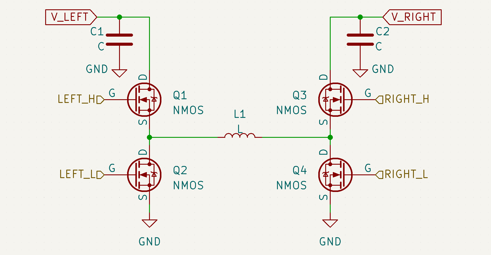

> 廉价，可靠，高效

<div align='center'>
    <font size="50"> RM2023香港科技大学ENTERPRIZE</font>
</div>

<div align='center'>
    <font size="80"> 数控超级电容方案开源</font>
</div>

<div STYLE="page-break-after: always;"></div>

# 前言

在RoboMaster机甲大师赛事中，严苛的底盘功率限制规则迫使各参赛队伍从软件和硬件方面研究高效的功率管理方案。早在2018年末，大连交通大学TOE战队，桂林电子科技大学Evolution战队与香港科技大学ENTERPRIZE战队等便相继开源了各具特色的超级电容方案。2020年，官方裁判系统超级电容管理模块与相关限制规则加入，超级电容的使用更加规范化，给各战队带来了不小的挑战。

2021赛季末大连理工凌_BUG战队开源了他们基于双向BUCK-BOOST电路构建的超级电容控制模块，引发广泛关注。我队取其精华，在其基础上进行数次迭代，历经一年时间，完成了低成本，稳定可靠，大功率，高效率的数控超级电容方案。本着技术交流和初心高于胜负的初衷我队现决定将此方案开源。欢迎大家交流学习。

<div STYLE="page-break-after: always;"></div>

# 方案回顾

自2018年超级电容方案诞生以来，其大致电路方案可分为以下3种

1. $电源\Rightarrow恒功率充电模块\Rightarrow超级电容\Vert底盘电机$
2. $电源\Rightarrow恒功率充电模块\Rightarrow超级电容\Rightarrow恒压放电模块\Leftrightarrow底盘电机$
3. $电源\Vert底盘电机\Leftrightarrow双向可控功率模块\Leftrightarrow超级电容$

笔者将基于自身理解对这些方案进行简单优缺点分析

## $电源 \Rightarrow 恒功率充电模块 \Rightarrow 超级电容\Vert底盘电机$

本方案直接明了，通过恒功率充电模块对整个底盘的输入功率进行控制，并通过超级电容对能量进行缓存。

该方案主要有以下几个优点：

1. 超级电容直接和底盘电机并联，相当于自带了高效的动能回收机制
2. 理想状态下能够保证在任何时候都无法超功率

在充放电的过程中，底盘电机母线电压是随超级电容电压的波动而波动的，因此该方案存在以下几个显著缺点

1. 如果电容电量过低，会导致底盘电机欠压保护，或工作不正常
2. 电压不稳定，会影响底盘电机的控制，具体可表现为相同参数下电机的输出力矩，转速等存在较大幅度波动。
3. 动能回收时，会有较大的倒灌电流涌入电容，对电容组及其保护板的设计有一定的考验。
4. 在机器人阵亡后，若电容仍有余电，底盘电机可能仍有足够电压继续移动一段时间，若不做处理可能违反规则
5. 模块之间串联，若有模块损坏或异常断电，则机器人底盘直接掉电，无法继续移动

## $电源\Rightarrow恒功率充电模块\Rightarrow超级电容\Rightarrow恒压放电模块\Leftrightarrow底盘电机$

该方案在上个方案的基础上增加了一个恒压模块，以稳定底盘电机母线电压。

因此，该方案有以下几个优点：

1. 与上个方案一样，理想状态下，底盘不会超功率
2. 在电容电量耗尽前，底盘电机的母线电压相对恒定，能够给电机提供良好的工作环境

由于恒压放电模块可能存在的一些特性，该方案可能存在以下几个缺点：

1. 若恒压放电模块为非同步boost/buckboost或者其控制策略不允许电流倒灌（例如其boost半桥上管采用理想二极管策略控制），则该方案完全无法进行动能回收，且在电机急减速时可能瞬间拉高母线电压，有较大风险烧毁电机
2. 在机器人阵亡后，若电容仍有余电，底盘电机可能仍有足够电压继续移动一段时间，若不做处理可能违反规则
3. 与上个方案一样，模块之间串联，若有模块损坏或异常断电，则机器人底盘直接掉电，无法继续移动。且由于恒压放电模块与底盘电机直接相连，工况较为恶劣，对该模块的设计有较大考验。

## $电源\Vert底盘电机\Leftrightarrow双向可控功率模块\Leftrightarrow超级电容$

该方案即为本战队本次开源的方案，灵感源自2021赛季大连理工大学凌BUG战队的开源。

在本方案中底盘电机直接连接到电源，超级电容和一个双向可控功率模块共同构成一个可控的功率补偿系统，凭借高速的功率闭环控制动态对底盘功率进行削峰填谷，从而实现超级电容的能量缓冲。

为便于理解，在此举例。

假设底盘功率限制为60W，电池电压为20V，超级电容处于半充满状态。

若此时底盘电机电流为2A，即底盘电机功率为40W，则双向可控功率模块将使用1A电流对超级电容充电，即充电功率为20W。将多余功率缓存在超级电容中。

若此时底盘电机电流为5A，即底盘电机功率为100W，则双向可控功率模块将使用2A电流对超级电容进行放电，此时放电功率为40W。利用超级电容中的能量补偿底盘功率。

若此时底盘电机电流为-2A，即底盘电机功率为-40W，则双向可控功率模块将使用5A电流对超级电容进行充电，此时充电功率为100W。即动能回收的过程。

该方案具有如下几个主要优点：

1. 并联接入底盘电机母线，即使系统工作异常，只需要及时切断电路（关断MOS管/保险丝熔断等），底盘任可继续正常工作。
2. 无论电容剩余能量如何，底盘电机的母线电压都能保持相对稳定，约等于电源电压，能够给电机提供良好的工作环境。
3. 可以主动限制动能回收的电流，允许部分浪涌电流倒灌回电源，防止损坏超级电容组。
4. 通过简单的代码逻辑，可在底盘电源切断时立即关断系统输出，在机器人阵亡后保存电容能量，同时避免违反规则。

该方案的显著缺点如下：

1. 采用数控方案，对嵌入式程序设计，控制系统设计要求较高，稍有不慎即可能损伤硬件。（本人调试时曾脑残将输出电压升至100V以上）
2. 采用并联方式被动补偿功率，若底盘电控不加以合理限制，仍有超功率风险。

显然，在参赛队伍硬件实力足够的前提下，第三种方案相较于前两种有极大优势。我们本次开源的方案即基于第三种。

<div STYLE="page-break-after: always;"></div>

# 电学原理

## 升压与降压

首先回顾经典的升压电路与降压电路。为方便理解，假设此处所有DC-DC电路均工作在CCM（连续导通）模式下，MOSFET（场效应管）为理想MOSFET，忽略死区时间， $R_{DSon}$ 等。

- Buck降压。下图左侧为非同步Buck电路，肖特基二极管起到为电感续流的作用。右侧为同步Buck电路，用MOSFET替代了二极管，带来了更低的压降与更灵活的控制。同步Buck电路中，CCM模式下，MOSFET经过**控制**，能够在电流正向的时候导通、反向的时候断开，实现了二极管的功能。

    通过伏秒平衡定律可推导Buck电路在CCM模式下的输入输出电压关系 $\frac{V_{out}}{V_{in}}=D$ ，其中 ${V_{out}}$ 为输出电压， $V_{in}$ 为输入电压， $D$ 为上管导通时间占整个PWM周期的占空比。

- Boost升压。下图左侧为非同步Boost电路，MOSFET对地导通时为电感充能，二极管在此处起到续流和防倒灌作用。右侧为同步Boost电路。用MOSFET替代二极管，在适当的控制下实现了二极管的功能。

    通过伏秒平衡定律可推导Boost电路在CCM模式下的输入输出电压关系 $\frac{V_{out}}{V_{in}}=\frac{1}{D}$ ，其中 ${V_{out}}$ 为输出电压， $V_{in}$ 为输入电压， $D$ 为上管导通时间占整个PWM周期的占空比（注意是上管）。

  受限于篇幅，在此省略伏秒平衡定律的具体推导过程。

## 双向升降压

同样的，假设一切条件全部理想，将Buck电路的前半段与Boost电路的后半段相连，我们可得到如下的四开关双向Buck-Boost电路。观察可见，此电路为对称结构。



### 假设电流从左往右流动

- 若将RIGHT_H常导通，RIGHT_L常断开，而LEFT_H和LEFT_L继续使用如上的Buck电路控制策略，则等效电路图如下图。这就是完全等效于Buck的拓扑，此时可将电路看作同步Buck，可实现将左侧电降压后提供给右侧。

  
- 若将LEFT_H常导通，LEFT_L常断开，而RIGHT_H和RIGHT_L继续使用如上的Boost电路控制策略，则等效电路如下图。这就是Boost的拓扑，此时将电路看作同步Boost即可实现将左侧电升压后提供给右侧。

  
- 第三种情况是需要的左电压与右电压相近。此时实际应用中由于最大占空比以及死区时间等限制，很难独立的使用Buck或者Boost拓扑。于是考虑用Buck控制策略控制左半桥，用Boost控制策略控制右半桥，此即为buck-boost电路。在任意时刻，电路可视为Buck电路或Boost电路。（此处省略了一些细节，如为了防止两边的下管同时导通，左右两边的上管占空比应相互制约，同时相位也应错开）此时，无论是使用叠加原理还是通过伏秒平衡定律，我们都可以得到如下结果 $\frac{V_{left}}{V_{right}}=\frac{D_{right}}{D_{left}}$ ，其中， $D_{left}$ 为左侧上管占空比， $D_{right}$ 为右侧上管占空比。

### 假设电流从右往左流动

由于电路完全对称，显然，仅需将Buck与Boost颠倒过来，即可实现与上述完全相同的效果，在此不做过多赘述。

经过同样的推导，我们仍然得到此结果 $\frac{V_{left}}{V_{right}}=\frac{D_{right}}{D_{left}}$ 。

### 总结

在控制这个四开关双向Buck-Boost电路时，实际上**不需要区分电路到底是Buck还是Boost**，也不需要关注电流的流向等，只需给予两个半桥合适的占空比，即可获得想要的左右电压之比。

这种不对电流流向做限制，强制上下管交替导通的控制方式被称为FPWM（强制脉宽调制）模式。由于实现此控制模式软硬件较为简单，本设计采用此控制模式进行控制。

注意：Buck与Boost的互相转换只在 *同步Buck/同步Boost* 中起作用。

## 电流控制

通过以上分析，我们现可构建一个四开关Buck-Boost双向升降压电路。

在RoboMaster以及大多数其他应用场景中。电路中的负载更偏向于阻性，即电压差越大，电流越大，根据这一特点，我们通过控制左右两侧的电压之比进而对左右两侧的平均电流进行控制。

此处举一个例子便于理解。假设左侧为电源，右侧为负载，根据以上分析，我们可推导出右侧电压越大，输出电流越大，右侧电压越小，输出电流越小。此时若输出电流大于目标电流，则我们通过改变左右两侧占空比，控制左右两侧电压之比增大，则右侧电压降低，输出电流也相应减小。若输出电流小于目标电流，则控制占空比减小，右侧电压升高，输出电流增大。当右侧为电压源时，只需反转控制逻辑，即可实现一样的控制效果。在RoboMaster超级电容的应用中，左侧和右侧均可作为负载或电源，当给超级电容充电时，超级电容侧为负载，当超级电容放电时，超级电容侧为电源。

在上述例子中，基于电流反馈控制占空比变化的方式有很多种，在本方案中，我们使用ADC对转换后的电流进行读取，之后使用PID计算所需占空比进行输出，从而实现电流闭环控制。

# 控制模块技术特点

## 实物图


## 硬件

- 上下板组合

  

  - 上板为FR4四层板，负责控制与驱动，带有MCU、信号调理电路、MOS驱动、电流感应放大器电路、CAN通信电路，以及相应的供电电路等。
  - 下板负责功率部分，为铝基板。带有保险丝、MOSFET、扁线功率电感、固态电容以及采样电阻等，利用铝基板加强散热，使得超级电容控制模块可以持续输出15A以上大电流而保持凉爽。
  - 上下板通过矮排针排母连接。模块化的设计方便快速更换组件，也方便维修上板或下板。
  - 功率线路从下板直接引出，导线直接焊接在焊盘上，大电流不需要经过上下板连接处，因此可以使用一般的排针排母进行简单的连接。

    

    *嘉立创贴片+手焊后的电容控制器上板*
  
- MOS驱动为UCC27211。采用隔离供电取代UCC27211的自举电容，从而能够实现100%占空比常开上管，显著提高单边Buck/单边Boost的转换效率

  - 通常，UCC27211使用一个自举电容串在引脚HB(BootStrap)与HS(Switching)之间，芯片自带自举电路，通过浮空自举电容来打开上管。这种做法体积小，但是自举电容需要充电，需要定期导通下管为电容充电来弥补自举电路及栅极驱动等的漏电电流，做不到100%占空比。因此实际上总是工作在buck-boost模式下。由于两侧MOSFET都需要不断开关，损失了一些效率。
  - 此处使用12V->12V DCDC的隔离供电模块。因为隔离供电模块为开环控制，输出电压极不稳定，且纹波极大，很容易炸毁栅极造成严重后果，所以此处使用RC滤波，并加入TVS(SMAJ10C)来钳位，保护上管不被高电压击穿。
  
- 电流感应放大器所需的1.65V参考电压源由运放电路使用3.3V分压产生。使用阻容网络进行相位补偿，防止驱动容性负载时环路不稳定产生震荡。

- 电流感应放大选择使用INA186差分放大器芯片

  在一众开源方案中，较多使用 INA240 作为电流感应放大器。然而INA240的价格与供应不如人意，在此背景下相关开发人员使用了 INA282 进行替代。但是，INA282 的封装为 SOIC-8，体积大，layout 占用过多空间。其次INA282 最小增益倍数为 50 倍，增益带宽较低，实际测试过程中出现信号失真的问题。 因此经过反复比对选型，最终使用了另一款电流感应放大器 INA186，选择其最低增益倍数的版本INA186A1。这款放大器体积小，支持双向电流采样，带宽也能达到标准，耐压能够支持高位采样的需求。但在实际测试过程中发现其对于共模干扰的抑制能力非常差，极易受到开关信号干扰。

  

  为应对此干扰，在实际电路设计中加入了 RC 滤波电路，截止频率13kHz，实测能够有效过滤共模干扰和电源本身的噪音。

  

  

  - INA186耐压高达42V，可以实现高位采样
  - 相比常用的INA240，INA186价格优势非常大，能显著节省整体成本
  - INA186的有效带宽20kHz，对于pwm频率约288khz的应用已经足够
  
- 使用全包裹铝壳，兼顾散热与保护

  

  *下板用导热胶贴在铝壳上，提高散热效果*

  

  *大小对比（与装甲板相比）*

  

  - 超级电容控制模块效率最高约97.8%。在处理大电流的情况下，不可避免地产生能量损耗，因而需要将热量导至铝制部件来散热。
  - 对于模块的外壳，我们采用工业化生产的全包裹铝壳。它既充当了散热组件，同时也能屏蔽电磁，防止超级电容控制板的EMI辐射影响敏感部件例如RFID、UWB等。
  - 全包裹铝壳同样有很好的结构强度，在恶劣的使用情况例如翻车、剧烈冲撞时可以有效保护内部功率电路。密封的设计也可以防止异物进入，例如打磨产生的铝屑，碳粉，以及香港恶劣潮湿气候常见的水雾等。这对于超级电容这种大功率的模块的稳定性和安全性而言非常重要。

## MCU外设使用

### MCU选择

- 四开关Buck-Boost电路中，开关频率越高，则需要的电感大小就越小，其体积也就越小。
- 我们使用STM32芯片的Timer外设输出开关控制的PWM信号。为了实现精准的占空比控制，时钟周期不能太小；而普通Timer外设的频率一般仅有几十上百兆赫兹，开关频率高与时钟周期大无法同时实现。为实现进准控制，我们选用HRTim即高分辨率定时器外设，内部带有倍频功能，可以倍频至4.9GHz，实现288KHz的PWM频率同时，也有16000的分辨度。
- 带有倍频功能HRTim的MCU中，能轻松买到的有STM32F334系列与STM32G474等。它们HRTim的功能几乎完全一样，而STM32G474比STM32F334有更高的主频与更先进的外设。然而，STM32G474在成本上有很大劣势，且大部分多出来的外设在超级电容上并不会有应用；同时，我们的代码在经过优化之后已经可以在STM32F334上以60%的内核占用实现36kHz频率的闭环，受限于电流采样带宽与开关频率，此闭环频率已足够应对RoboMaster赛场上复杂的工况。因而我们最终选择了简单实惠的STM32F334作为此项目的MCU。

### 外设配置

#### HRTIM Master Clock

- 调整倍频与周期，使PWM频率为288kHz

#### HRTIM Timer A

- 负责A半桥MOS的开关信号
- 负责触发A侧的ADC采样

#### HRTIM Timer B

- 同理

#### 死区控制

* 同一边半桥的上下管绝对不能同时打开，否则电流回直接通过上下管对地短路，造成严重后果。同时，MOSFET导通时需要给栅极电容充电，需要一个几到几十纳秒的过程。因此，我们打开了HRTimer外设的Dead Time功能，从外设层面防止上下管对穿。我们为了防止MOSFET开关过快导致振铃，配置的上升下降时间较大，死区时间通过测试得出：8分频下Rising与Falling各约110。
* 若死区时间太大，则在死区时间的后半段，由于MOS管没有及时开启，会有很多电流从MOS管的寄生二极管处流过，降低效率并增加过热烧毁的风险；若死区时间太小，则前一个MOS还没有完全关断的时候后一个就已经打开了，此时容易发生上下管对穿的情况，会严重发热，烧毁MOS管。
* 实际调节死区时间时，可使用具有恒压恒流功能的可调电源给数控超级电容模块进行供电，逐步调小死区，当可调电源突然出现CC（恒电流）模式时，代表死区时间过小，上下管之间已经短路，在此时的死区时间基础上添加一个安全冗余即为合适的死区时间。为了防止用户代码层面对死区进行错误修改导致灾难性后果，可配置死区相应寄存器进入只读模式，防止配置成功后二次修改。

====

* *同时*，左侧与右侧半桥的下管也不能同时打开，否则就相当于电感两端经过GND短路，使其储存的电磁能瞬间转化成热能。在我们的实际应用中，我们错开了TimerA与TimerB的相位180°，并限制Buck-Boost模式下TimerA与TimerB的上管占空比均不得小于50%来实现这一功能。

#### HRTIM ADC Trigger


在电路实际工作过程中，MOSFET的开关会给电压带来纹波进而产生电流纹波。为防止MOSFET开关瞬间引入电流采样共模干扰，或产生的电流纹波影响采样，电流的采样时机应当正好处于对应侧上管PWM波形的中点，此时瞬时电流值等于平均电流值，瞬时电压值等于平均电压值。我们通过如下配置来实现这一功能。

- TimA Compare2 -> ADC Trigger 1
- TimB Compare2 -> ADC Trigger 3

#### ADC1

- CH1 -> V_SENSE_A（左侧电压采样）
- CH2 -> I_SENSE_JUDGE（裁判系统电流采样）
- CH3 -> I_SENSE_A（左侧电流采样）
- 触发事件：HRTIM Trigger 1 Event

#### ADC2

- CH7 -> I_SENSE_B（右侧电流采样）
- CH8 -> THERMAL_SENSE（温度采样）
- CH9 -> V_SENSE_B（右侧电压采样）
- 触发事件：HRTIM Trigger 3 Event

#### ADC读数校准

- 由于硬件上的误差如电阻阻值、运放芯片的体质等区别，采得的ADC读数会有误差。我们对每一个硬件都进行校准，并将校准数据写入宏，在编译期控制。
- 将读数误差视为线性的，则每一个数据有对应的bias与gain。经过校准之后，不同控制板的电流电压读数几乎一致。
- 将硬件ID写入Bytecode，防止烧错代码（编译时flag写错）。

## 软件

### 充放电控制策略

- 采用多环串联PID：最外环为裁判系统功率闭环，而后功率闭环，最后同时闭环电压与电流。

  - 功率、电压和电流闭环速度为 36kHz，能量闭环速度为 10Hz，通讯频率为 1kHz。
  - 为了实现软启动与无扰切换，我们在电容关断输出不开关 MOS 管时，时刻保持内部 HRTIM 的 PWM 占空比等于两侧电压之比，这使得启动电容的瞬间不会产生巨大的冲击电流。
  - 在具体输出 PID 结果时，我们采用了电压前馈控制，PID 结果在两侧电压之比上进行补偿，有效提升了瞬态响应与控制的线性度。

  配图

### VBToVA -> 两半桥PWM占空比

经过PID运算后得出 $V_BToV_A$ ，既理想情况下两侧电压之比。

1. $V_BToV_A < 0.8$，则视作从**从左往右的Buck模式**。 此时右侧上管常开(100% Duty Cycle)，左侧作为同步Buck，则左侧上管的占空比即 $V_BToV_A$ 。
2. $V_BToV_A > 1.25$，则视作**从左往右的Boost模式**。 此时左侧上管常开，右侧为同步Boost，右侧上管的占空比为 $\frac{1}{V_BToV_A}$ 。
3. $V_BToV_A\in[0.8, 1.25]$ ，则Buck或者Boost难以实现这样的升降压。于是采用**Buck-Boost模式**。 此时左侧上管占空比 $\frac{4}{9}\cdot(1+x)$ ，右侧上管占空比 $\frac{4}{9}\cdot(1 + \frac{1}{x}) $，这个值满足 $\frac{D_A}{D_B} = \frac{V_B}{V_A}$ ，且保证两边占空比的变化是连续的，可实现无缝衔接，防止占空比突变导致的控制不稳定。

### 通讯与底盘功率控制策略

* 为保持通讯稳定性，使用CAN协议进行通讯，硬件上之间将CAN总线接入底盘电机所在的CAN总线，保证能读到电机即能读到电容反馈。
* 每毫秒向底盘控制板反馈电容剩余能量、底盘瞬时功率、瞬间最大输出功率等信息，辅助底盘控制板上的功率控制代码进行底盘电机功率控制。
* 每100毫秒接收一次来自底盘控制板的回报信息，包括来自裁判系统的剩余能量信息，来自裁判系统的功率限制信息，电容模式控制信息等。利用此信息对功率控制的误差进行修正（能量闭环），并在必要时刻提升瞬态响应（回家后功率瞬间翻倍）。

### 故障处理

该模块为了保障安全性，设计了数种故障模式，排查了几乎所有会导致灾难性后果的情况。此模块工作之稳定，在整个RoboMaster2023的赛季开发中，扛住了数次接错线、电容组极性接反、输出短路、信号调理部分电路短路等严重故障，至今未出现任何损坏烧毁的案例。

- 过压保护

  - 模块会检测电容与底盘的电压，若电压过高，为防止模块本身工作异常导致毁灭性后果，会自动进入锁定状态。
  - 模块认为，任何时刻，AB 电压均不得大于 31V。若检测到超过 31V 的电压，模块会立即进入锁定状态。
  - 刹车制动时，底盘电机会将能量倒灌回裁判系统，这些能量的部分会被模块吸收，但当电容充满或倒灌能量过大，电容无力吸收这部分能量，会导致底盘电压升高。为保护底盘电机，防止因模块本身异常导致底盘电机烧毁，模块会检测超过 27V 的底盘电压，若符合一定逻辑，则进入锁定状态，任由能量倒灌回电池。

  对于底盘输出电压有以下检测逻辑:

  1. 若底盘电压持续大于 27V 但小于 28V 超过 300ms，则进入过压状态。
  2. 若底盘电压持续大于 28V 但小于 29V 超过 60ms，则进入过压状态。
  3. 若底盘电压持续大于 29V 但小于 30V 超过 12ms，则进入过压状态。
  4. 若底盘电压持续大于 30V 但小于 31V 超过 3ms，则进入过压状态。
  5. 当 A 相电压小于 27V，B 相电压小于 31V，过压锁定自动解除，模块自动尝试重新启动。
- Buckboost 故障

  - 由于校准误差，代码跑飞或逻辑bug，局部短路等问题，模块可能会出现升降压部分工作异常的情况，当检测到此部分电路工作异常，模块进入锁定状态，关断输出，且不会自动尝试重新启动，需要用户手动重置。
- 短路

  - 当模块检测到短路，会立即关断输出，短路状态立即解除，之后模块会尝试重新启动输出。 若短时间内连续检测到多次检测到短路故障，模块认为硬件损坏，不再尝试重新启动输出，需要用户手动重置。
- 高温

  - 当模块检测到温度过高，会进入高温保护状态，关断输出。 待温度下降后自动恢复，重新启动输出。
- 裁判系统供电丢失

  - 当模块检测到裁判系统供电丢失时（通常为机器人阵亡），自动关断输出。 待裁判系统供电恢复时，自动尝试重新启动。
- 电容组故障

  - 当模块检测到超级电容故障，模块进入锁定状态，关断输出，且不会自动尝试重新启动，需要用户手动重置。
  - 检测超级电容故障的逻辑如下：
  - 1. 当超级电容电压变化达到一定阈值时，若充入超级电容的电荷量过低，认为与超级电容之间的连线断开。 （有效电容值过低）
    2. 当充入超级电容的电荷量达到一定阈值时，若超级电容的电压变化过小，认为超级电容局部短路，过充，或漏电。
    3. 为防止电荷量累计漂移误差，若未处于故障状态，每隔一段时间会重置故障检测。
- 超级电容控制器配合新电容组可以判断正负极性错误

  - 如果正负极接反，电容处于空电状态，会判定为短路，发出短促的嘟嘟嘟提示音。
  - 如果电容正负极接反，且电容处于满电状态插入，将会剧烈打火并烧毁电容控制器下板上对应的TVS或保险丝，从而保护控制部分电路与MOS管。此后无论是否接电容，再次给超级电容控制器通电都会发出短促的嘟嘟嘟提示音，需要更换超级电容控制器上的TVS与保险丝

  故障提示及处理

1. 当超级电容进入任何故障状态后，红灯处于闪烁状态，且同时切断输出，以 200Hz 持续时间 200ms 的低频提示音表示。若此时绿灯亮起，表明超级电容正尝试重新启动，若绿灯不亮，则需要用户手动重置 超级电容模块。重置方法如下：
2. 用户可手动断开所有电源连接线，之后再逐个插入，超级电容即重新启动，若顺利通过故障检测， 则故障状态解除。
3. 用户可通过 CAN 发送重启指令，超级电容重新启动，若顺利通过故障检测，则故障状态解除。
4. 用户可通过 CAN 发送关断输出指令，之后再次发送启动输出指令，超级电容会尝试重新启动输出， 若未再次发生故障，正常运行一段时间后故障状态自动解除。

### 附加功能

- 监测裁判系统供电电压。若常低于某一值（约20V），则认为电池即将耗尽，蜂鸣器长鸣。用来提醒调试人员，防止出现调试代码未保存的情况。

# 电容组硬件

## 原理与设计比较

储能元件采用超级电容，耐压2.7V。电容组先并联再串联，增大耐压至29.15V，最终储能能力1931J。为了防止充电过程中由于电容体质不同，使得：有些节点还没充满时，另一些电容已经超过耐压的情况，使用均衡电路。

均衡电路分为主动均衡与被动均衡。

**被动均衡**一般通过电阻放电的方式，对电压较高的电容进行放电，以热形式释放电量。

此方案的优点是电路结构非常简单，研发成本也很低。先前可使用TL431电压基准模块进行简单搭建。后续随着BW6101超级电容保护芯片的推出，此方案更加简单廉价。

缺点较为显著，首先均衡时不存在电能转移，所有均衡的能量都通过电阻发热释放，理论上的均衡效率为0%。同时转移时会产生大量的热能，若不加处理，可能会烧毁电路。

**主动均衡**是一种复杂的均衡技术，在充电和放电循环期间，使得电容单元内的电荷得到重新分配，从而缩短充电时间，延长放电使用时间。如：

1. Flying Capacitor

   此电路实现了电荷泵，通过不断地控制开关，将电压较高的单元内电荷转移至中间电容器中，再转移至电压较低的单元。

   

   此方案的优势是具备主动均衡能力，理论上电容组可串联不同容量的超级电容。

   缺点是均衡速度不够快，可能需要添加被动均衡电路防止大电流充电时均衡失败。同时，额外的MOS管驱动方案也对设计者提出了较高的要求，额外的器件也带来了更多的成本。效率上，相比被动均衡，部分能量得到了重复利用，但是驱动MOS管开关也会带来额外损耗，建议把控好启动均衡的阈值电压，在电压较低时不启动MOS管驱动，节省能量。
2. 电感转换器

   使用电压较高的单元给电感充能，然后电感给电压较低的单元充电。

   

   此方案类似变形的buck电路，通过电感和电容组成的dcdc电路转移能量。其理论上能产生更大的均衡电流，但仍然存在上一个方案的一些缺点。同时如需更大的均衡电流，需要选择更大体积的功率电感，同样也会使总体体积增大。
3. 反激式电感转换器

   使用变压器实现所有电容一起给一个或多个电压较低的电容充电，通过精确反馈控制逐渐均衡各电容单元电压。

   

   此方案优缺点与上述两个方案类似，但还存在一个额外的缺点，即很难找到这种多绕组的变压器成品，在设计时可能需要自行制作变压器，较为繁琐，对设计制作要求较高。

总而言之，主动均衡能达到比被动均衡更高的能量利用率，然而在体积、效率、成本、可靠性上难以平衡。因此，我们最终在本赛季放弃了主动均衡，使用基于电阻泄放的被动均衡结构制作了电容组阵列。

## 原理图


图为一个电容单元。设计的电容组中共有11个该单元串联。


控制芯片为BW6101，该芯片在电容电压(VDD - GND)大于2.65V时，控制NMOS对地导通，此时电流通过泄流电阻对地泄放，从而消耗电容中过多的能量。

此处使用3个电阻串联，而不是并联的原因是难以找到1Ohm以上的大功率电阻，此处使用的0.3Ohm电阻为电流采样电阻，功率较大（3W），能够承受更大的泄放电流。

由于电容组需要经过裁判系统超级电容管理模块，而管理模块额定电流为15A，为了裁判系统的稳定工作及排除电流超限带来的偷功率嫌疑，我们将电容组的充放电电流限制为14.5A。在此约束下，电压越高，电容放电功率越大。我们选择11个2.7V 50F的超级电容串联，能够带来更高的最大电压，从而最大化输出功率，但由于超级电容等效串联电阻的存在，这种方案会较大程度损失效率。同时，值得注意的是，BW6101在电容充电至2.65V时就已经开始均衡，为减少均衡损耗，提升系统综合稳定性，我们决定只将电容充电至2.65V。

实际使用过程中，为防止非硬件开发人员拆装及使用电容组时由于经验不足错误操作发生危险，我们在电容组的输入端加入一个大功率单向TVS，在严重过充时可烧毁短路，保护电容组，若电容组与数控超级电容控制模块的正负极接反，该设计可配合短路保护功能进行保护，防止对电容组进行反极性充电。同时我们还加入了一个LED灯，用来警告操作人员电容的带电情况。在RoboMaster2023的备赛中，我们发生了至少两次电容组极性接反的情况（XT30反着用力插也是可以插上的），均触发了过流保护成功即使关断。提示灯也多次在拆装电容组时提示操作人员带电情况，对电容及时放电。我们在整个备赛期间未发生任何一起电容组过充、短路、起火等严重后果。

## PCB


Layout 参考

该模块layout较为极限，所有电容紧贴排列。为了加强散热，使用四层板。其中内层1、2与顶层铺铜相同，起导热作用。底层放置MOS与芯片等元件，并利用开窗导线减小电阻。过充测试时，使用2.5A电流长时间对电容组进行充电，电容组未出现严重过热情况，电容未出现过充情况。

## 实物


超级电容组体积仅为60x76x45mm，在经费有限无法定制的情况下实现了较小的体积，机械设计更加自由。

# 总结

## 技术总结

本模块通过数控Buck-Boost电路，接受裁判系统或开发板的指令并反馈，来实现裁判系统输入功率闭环。闲时为电容组充电、有需求时为底盘放电。升降压的拓扑使电容组内能量利用率很高，且

通过软件控制，既可以弥补硬件上补偿的不足，也可以实现更灵活的功率闭环、甚至裁判系统能量缓冲闭环。

## 使用方式

### 硬件连线

功率线有三组：

- 左端有一根XT30公线，连接裁判系统电源模块Chassis接口
- 左端XT30母线，连接到其他底盘功率器件（如底盘电机等）
- 右端XT30公线，连接到超级电容组（经过CM01模块）

信号线

- MX1.25x4pin插座可以连接SWD调试线
- GH1.25x2pin插座连接CAN信号，与主板通信
- 预留了GH1.25x4pin IIC接口，可以连接OLED屏幕作为调试用

### 通信协议

```c++
struct CapacitorStatus
{
    //本段结构体位于机器人控制代码与超级电容通信的Driver层中
    struct CapacitorRx
    {
        uint8_t errorCode;
        float chassisPower;
        uint16_t chassisPowerLimit;
        uint8_t capEnergy;
    } __attribute__((packed)) capacitorRx;

    struct CapacitorTx
    {
        uint8_t enableDCDC : 1;
        uint8_t systemRestart : 1;
        uint8_t resv0 : 6;
        uint16_t feedbackJudgePowerLimit;
        uint16_t feedbackJudgePowerBuffer;
        uint8_t resv1[3];
    } __attribute__((packed)) capacitorTx;

    bool isConnected;
};
```

## 测试结果

### 极限转换效率


*极限效率0.975，一般效率约0.95*

### 输出纹波@5A


*Buck模式，占空比0.7：纹波25mV*


*Buck-Boost模式，“占空比”为1.0：纹波约50mV*


*Boost模式，占空比0.75，纹波32mV*

## 发展方向

### 超级电容控制器

对于该版本控制器，大负载测试中发热极小，无需较大的散热面积与两MOS管并联的设计，体积可以很大程度的缩小；同时，有部分元件可以缩减，比如电压跟随运放可以利用MCU(STM32F334)内部的运放，从而减小复杂度、成本与体积。

为方便控制与简化硬件设计，本方案选用了理论效果不算出众的软件平均电流控制模式。可考虑略微修改硬件，以使用基于硬件比较器触发的电感峰值电流控制，实现逐周期电流闭环，提升系统响应。同时，本方案使用FPWM（强制脉宽调制）模式进行控制，这种控制方案在低负载情况下电感上会有电流反向流动，同时开关频率恒定，轻载时效率较低，瞬态响应一般。可考虑采用COT（恒定导通时间）提升瞬态响应，考虑加入PFM（脉冲频率调制）提升轻载效率。

考虑到软件控制电压电流等闭环确实存在不稳定因素，今后也考虑使用一些内置ARM内核和硬件反馈环路的数字电源控制芯片。它们一方面使用硬件环路补偿、开关控制等，更加稳定、集成度高，另一方面也可以烧入代码，实现功率、能量闭环、裁判系统通讯、底盘控制等操作，灵活性高。

而运用其他DC-DC拓扑的控制器也可以研究，例如Flyback（反驰）拓扑升降压，理论上可以用更少的MOS管与更简单的驱动电路（仅低位驱动）来实现给电容充电放电等功能。


## 后记与致谢

大约于2018年，大连交通大学TOE战队，桂林电子科技大学Evolution战队与香港科技大学ENTERPRIZE战队等便相继开源了各具特色的超级电容方案，推动了RoboMaster中各队对突破底盘功率限制的技术发展，也使得这一项目进入规则中。在此对各位拓荒的前辈们致以感谢。

2021年，大连理工大学凌_BUG战队首次开源了基于Buck-Boost的超级电容控制器。这种架构作为目前阶段（RM2023）中超级电容控制的的最优解，对本项目有极大的参考价值。

从时间线上看来，其实我们在2018年之后就拥有了可用的超级电容，并且多年来一直实装，效果很好。然而经过漫长的四年，一方面老超级电容确实存在资料较少、难以传承的问题，导致维护起来难（甚至老的设计上使用的元件都找不到了）；另一方面，光速翼首发的Buck-Boost架构双向超级电容比起我们的老电容（单向传输能量）在各方面上都有着非常大的提升。因而我们开启了这个新项目。

在超级电容的设计过程中，其他队伍的开源给予了我们莫大的帮助，在此感谢大连理工大学凌_BUG战队、西交利物浦GMaster战队与仲恺奇点战队的开源，以及在网上和七黄、光速翼的交流。也非常感谢嘉立创的免费打板与SMT服务（板子上元件很多，还好抽到了贴片券，节省了大量人力）。

2023赛季这时候已经进入尾声，愿Enterprize战队在RM2024继续前进，再创新高！

最后，喊出那句口号，**初心高于胜负!**

